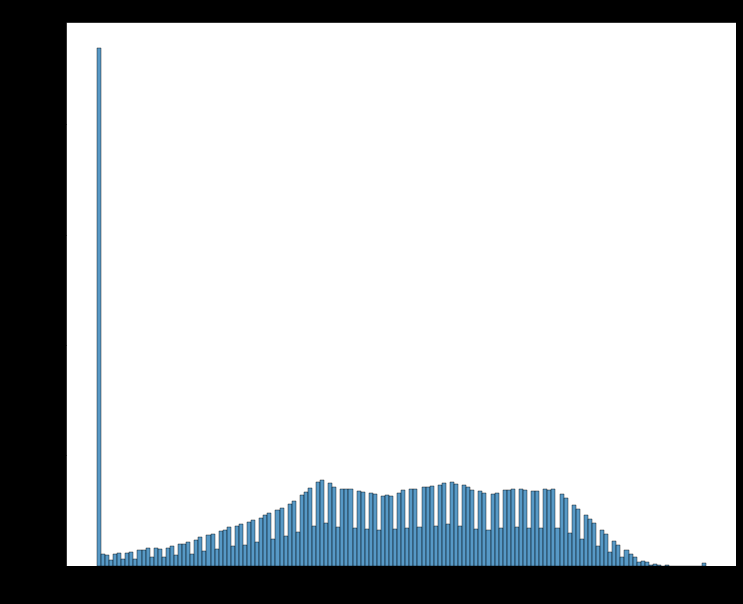
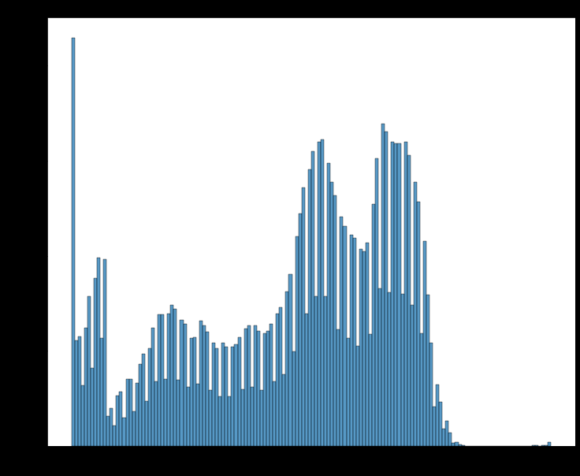
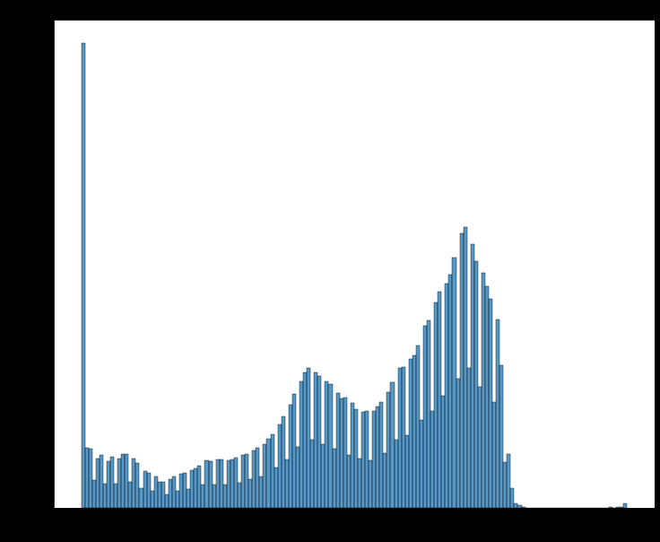

## Overview

**Neural** **networks** **(NN)** **are** **used** **in** **this** **study** **to** **forecast** **a** **binary** **classification** **target** **for the county Government of Nairobi , Health Department**. **The** **data** **was** **obtained** **from** **a** **Mendeley** **dataset** **that** **was** **made** **available** **on** **Kaggle.** **In** **order** **to** **determine** **whether** **a** **patient** **has** **pneumonia** **or** **not,** **models** **were** **developed.**

### Problem Statement

The Nairobi County Government's Department of Health plans to use technology to screen patients for pneumonia, enhancing efficiency and identifying cases for proper care.

### Data Understanding

The dataset was from Kaggle's chest xray dataset. It contained the following:

Train set:

* PNEUMONIA=3875
* NORMAL=1341

Validation set:

* PNEUMONIA=8
* NORMAL=8

Test set:

* PNEUMONIA=390
* NORMAL=234

The dataset was modified to be:

Train set:

* PNEUMONIA=3575
* NORMAL=1041

Validation set:

* PNEUMONIA=308
* NORMAL=308

Test set:

* PNEUMONIA=390
* NORMAL=234

Due to the incredibly little data in the validation set, the data was adjusted.

The appropriate folders were used to move images from the train dataset into the validation dataset.
A typical x-ray's picture histogram appears as follows:

